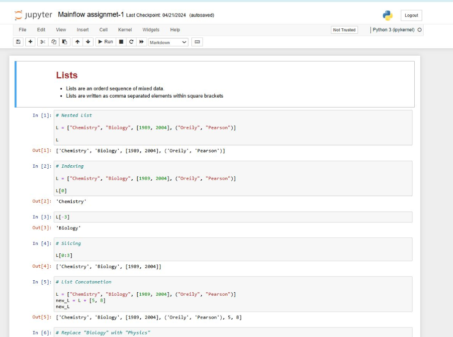
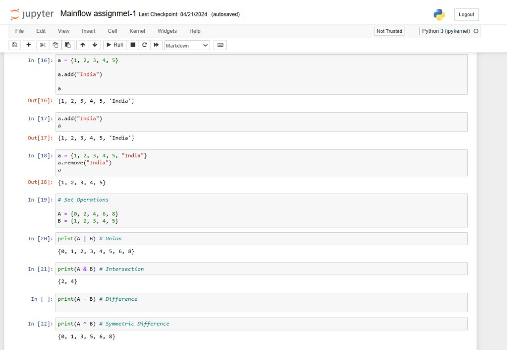

# 🚀 **Data Analysis Odyssey**  
_A journey through data, one week at a time._  

Welcome to my **Data Analysis Odyssey**! This repository chronicles my two-month adventure in exploring the vast universe of Python-based data analysis, visualization, and modeling. From mastering the basics to conquering advanced techniques, this project captures my growth, learnings, and accomplishments week by week.  

---

## 🌟 **Project Highlights**  

🔍 **Data Exploration:** Unlocking the stories hidden within raw data.  
📊 **Visual Masterpieces:** Turning numbers into art with charts and plots.  
🧠 **Feature Engineering:** Crafting insights for smarter models.  
📚 **Advanced Techniques:** From time series forecasting to sentiment analysis and clustering.  

---

## 🗂️ **Table of Contents**  
1. [Getting Started](#getting-started)  
2. [Weekly Objectives](#weekly-objectives)  
3. [Tools & Technologies](#tools--technologies)  
4. [How to Use](#how-to-use)  
5. [Repository Structure](#repository-structure)  
6. [Acknowledgments](#acknowledgments)  

---

## 🎯 **Weekly Objectives**  

### **Week 1 (June 5 – June 11): Python Fundamentals**  
- 🛠️ Create and manipulate lists, dictionaries, and sets.  
- ✨ Perform operations like adding, removing, and modifying elements.
<hr>

<br>




### **Week 2 (June 12 – June 18): Data Manipulation with Pandas**  
- 📥 Load datasets into DataFrames.  
- 🔎 Filter, clean, and summarize data.  
<hr>

<br>


### **Week 3 (June 19 – June 25): Data Visualization Magic**  
- 📊 Create bar and line charts with Matplotlib.  
- 🎨 Customize visuals with titles, labels, and legends.
<hr>

<br>


### **Week 4 (June 26 – July 2): Exploratory Data Analysis (EDA)**
- 🔍 Uncover data patterns with distributions and correlations.  
- 🚨 Identify and visualize outliers.
<hr>

<br>


### **Week 5 (July 3 – July 9): Feature Engineering & Selection**  
- 🧩 Engineer new features to enhance datasets.  
- 📉 Use PCA and feature importance to select the best attributes.
<hr>

<br>


### **Week 6 (July 10 – July 16): Time Series Forecasting**  
- 📈 Detect trends and seasonality using time series analysis.
<hr>

<br>


### **Week 7 (July 17 – July 23): Sentiment Analysis & Text Mining**  
- 💬 Analyze unstructured data for sentiment and insights.  

### **Week 8 (July 24 – July 31): Clustering & Classification**  
- 🌀 Segment data with clustering.  
- 🧠 Apply classification techniques for pattern recognition.  

### **Week 9 (August 1 – August 5): Final Touches**  
- 📝 Document findings and create stunning reports.  

---

## 🛠️ **Tools & Technologies**  
- **Languages:** Python  
- **Libraries:** Pandas, Matplotlib, Seaborn, Scikit-learn, NLTK  
- **Visualization:** Seaborn, Matplotlib  
- **Machine Learning:** Scikit-learn  

---

## 🧑‍💻 **How to Use**  

1. **Clone the Repository:**  
   ```bash  
   git clone https://github.com/your-username/data-analysis-odyssey.git  
   cd data-analysis-odyssey  
   ```  

2. **Install Dependencies:**  
   ```bash  
   pip install -r requirements.txt  
   ```  

3. **Run the Code:**  
   Navigate to the corresponding week's folder and execute the scripts.  

---

## 📂 **Repository Structure**  

```plaintext  
data-analysis-odyssey/  
├── week1_basics/  
├── week2_data_manipulation/  
├── week3_visualization/  
├── week4_eda/  
├── week5_feature_engineering/  
├── week6_time_series/  
├── week7_sentiment_analysis/  
├── week8_clustering_classification/  
├── week9_final_review/  
├── README.md  
└── requirements.txt  
```  

---

## 🌈 **Visual Sneak Peek**  
  
_A glimpse into the visualizations crafted during the journey._  

---

## ❤️ **Acknowledgments**  
This project reflects my growth as a data enthusiast. Thanks to my mentors, peers, and the open-source community for their support and inspiration throughout this journey.  

---

🌟 **Let’s unravel the mysteries of data together!**  
👾 Feel free to explore, fork, and contribute to this project.  

--- 

Would you like a customized logo for your repository or additional sections?
